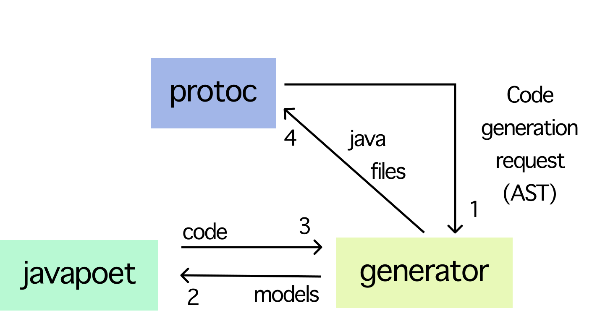

PROTOGEN DESIGN GUIDE
=====================

Protogen has 3 main parts which work together to produce code. It's the generator itself, protoc and javapoet.

* Protoc is the protobuf language compiler that allows to plugin at the compilation phase
* Javapoet is the tool that allows to generate human-readable code by its model with graceful API
* The generator transforms protobuf AST to domain classes and clients

**Protoc's plugins are executables** that consume input from _stdin_ and produce output into _stdout_. So there is
no need to make the generator an _implementation_ dependency, just build it before the protoc runs.

### Modules

* **Options** are made to define the external options of the plugin. They are separated because they have to be
  a run-time dependency, unlike the generator which is a compile-time dependency.
* **Javapoet** is a fork of [square/javapoet](https://github.com/square/javapoet) supporting records
* **Generator** - plugin and model assembly
* **Tests** as the plugin is an executable its external tests were separated to ask gradle build generator first

### Generator packages

* _org.sudu.protogen.descriptors_ - Delegates for protoc descriptors encapsulate generation logic into them
* _org.sudu.protogen.protoc_ - Utilities for protoc and its specifics
* _org.sudu.protogen.config_ - In-code configuration
* _org.sudu.protogen.generator_ - Builds javapoet models